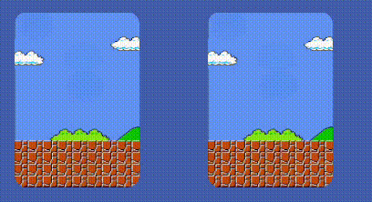

# Memory-card-game
----------------------------------------------------------------

##  How to play
----------------
                Flip two cards to reveal them.

                Match pairs of cards to keep them face-up.

                Match all pairs to win the game!

                Win in fewer moves to set a new high score!

----------------
    Note: You can change difficulty mode while playing but that will restart the game.
    Default difficulty mode is easy.
Good luck! 🎮
