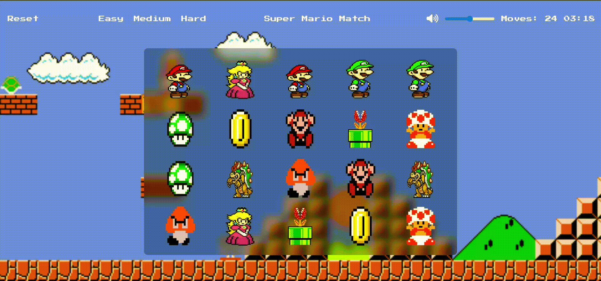

 </a> 

# 🎮 Memory Card Game
----------------------------------------------------------------
 * Memory Card Game is a fun and interactive game that challenges players to test and improve their memory skills.
 * Players flip cards to find matching pairs.
 * aiming to complete the game in the fewest moves possible.
----------------------------------------------------------------
## 🕹️ How to play

               ✨ Choose your preferred difficulty level Easy,Medium or Hard.

               🔄 Flip two cards by clicking on them to reveal them.

               ✅ Match pairs of cards to keep them face-up.

              🏆 Match all pairs to win the game!

               🎉 Win in fewer moves to set a new high score!

              📋 Note: You can change difficulty mode while playing but that will restart the game.

## Technologies Used
1. **HTML**  </a> 

2. **CSS** 

3. **JavaScript**   </a> 

--------------------------------------------------------
## 💭Contribution

Contributions are welcome! If you have ideas or suggestions, feel free to open an issue or submit a pull request.

--------------------------------------------------------

# 🤝 Team Members
&nbsp;&nbsp;_Menna Rashad_ &nbsp;&nbsp;&nbsp; |&nbsp;&nbsp;&nbsp;&nbsp; _Abdo Hasan_ &nbsp;&nbsp;&nbsp; &nbsp;&nbsp;&nbsp;&nbsp;    | &nbsp;&nbsp; &nbsp;&nbsp;&nbsp;  _Omar Mohamed_ &nbsp;&nbsp;&nbsp;  &nbsp;&nbsp;&nbsp;  | &nbsp;&nbsp;&nbsp;_Omar Mamdouh_ &nbsp;&nbsp;&nbsp;

&nbsp;&nbsp;&nbsp; &nbsp;&nbsp;&nbsp; &nbsp;&nbsp;&nbsp; &nbsp;&nbsp;&nbsp; &nbsp;&nbsp;&nbsp; &nbsp;&nbsp;&nbsp; &nbsp;&nbsp;&nbsp;&nbsp;&nbsp;&nbsp;   &nbsp;&nbsp;&nbsp; &nbsp;&nbsp;&nbsp; &nbsp;&nbsp;&nbsp;&nbsp;&nbsp;&nbsp; 

&nbsp;&nbsp;&nbsp;
&nbsp;&nbsp;&nbsp;&nbsp;&nbsp;&nbsp;&nbsp;&nbsp;&nbsp;&nbsp;&nbsp;&nbsp;

&nbsp;&nbsp;&nbsp;&nbsp;&nbsp;&nbsp;&nbsp;&nbsp;&nbsp;&nbsp;&nbsp;&nbsp;&nbsp;&nbsp;&nbsp;

&nbsp;&nbsp;&nbsp;&nbsp;&nbsp;&nbsp;&nbsp;&nbsp;&nbsp;&nbsp;&nbsp;&nbsp;&nbsp;&nbsp;

##                              
<a href="#top">🔝Top🔝</a>

